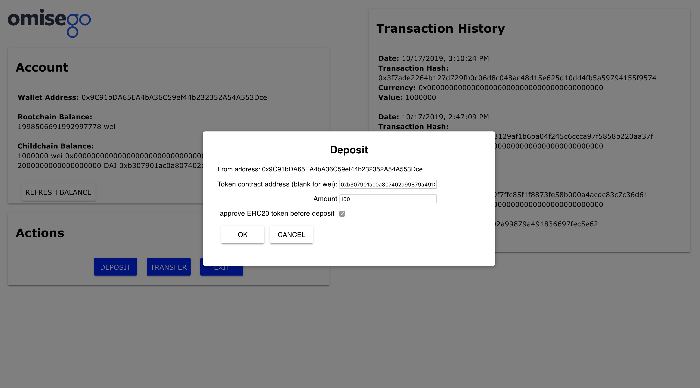

# Transacting DAI on OmiseGO Network through the browser

Estimated time: 5 minutes

Goal:

- To understand plasma transactions with ERC20 token using DAI
- To get first hand experience in making ERC20 interactions with plasma
- To learn the process of making `deposit`, `transact` and `exit` with ERC20

In this guide, we will introduce to you the Plasma Interface by making transactions directly from your browser. Just make sure you have the following installed:
1. node-js >10.0.0
2. npm > 6.0.0

Have access to a code editor, browser with a web3 wallet like MetaMask

### Note

This guide is meant for **Samrong** and any v0.2 instance of OMG Network

### Initial Setup
1. Clone the latest version of `js-starter-kit` onto your local machine. The repo can be found here https://github.com/omisego/js-starter-kit

2. Open up the `config.js` on your text editor

3. Replace the current configs in `config.js` with the  [following Network Endpoints for Samrong](https://github.com/omisego/dev-portal/blob/master/guides/network_endpoints.md) then save the file.

4. install all the dependencies `npm install`

5. start the app up by running `npm run dev`

#### 1. Funding the wallet with DAI

1.1. the clientside wallet will rely on the funds you have on your existing account. In order to run the JS-Starter-kit, make sure you have sent yourself some Rinkeby Testnet DAI. We will use that later to make ERC20 transactions. DAI ERC20 contract can be found here: 

https://rinkeby.etherscan.io/address/0xb307901ac0a807402a99879a491836697fec5e62

#### 2. Deposit DAI

2.1. Before you can deposit any ERC20 token, you must first approve amount you would like to deposit. Click on the DEPOSIT button, put down the DAI token contract address, choose the amount you would like to deposit in DAI. Click on the check box approve ERC20 token before deposit []. Click OK. There should be a metamask popup, click on Confirm.

  

2.2 After the transactions have been confirmed, you are free to make the deposit. Once again, click on the DEPOSIT button, put down the DAI token contract address, choose the amount you would like to deposit in DAI. This time, leave the approve box unchecked. Click OK. There should be another metamask popup to verify that you would like to deposit ERC20 token, click on Confirm.

2.3. You can refresh balance via the [refresh] button. After a while, your balance childchain balance will be updated with the new DAI amount, note that the balance is in lowest denomination of the ERC20 token (18 digits for DAI)

### 3. Transfer DAI

3.1. Click on the TRANSFER button. Choose DAI as the token to transfer. Fill in the amount you would like to transfer, including the address of the recipient- this can be another wallet you own on MetaMask. Click Okay and there should be a popup that shows the message you are trying to sign- here you can inspect the inputs and outputs of your transactions. After making sure this is accurate, click Confirm.

3.2. To see the status of your transaction. You could also open up your browser console and retrieve the TX hash, by searching for the hash through [Plasma Block Explorer](http://quest.samrong.omg.network) you should see the details of the transaction.

#### 4. Exit

4.1. Once you are done, simply click on the EXIT button and select the DAI UTXO that you would like to exit and click on Okay.

Congratulations, you have now gone through the end-to-end process of making DAI transactions on the OmiseGO Network.

